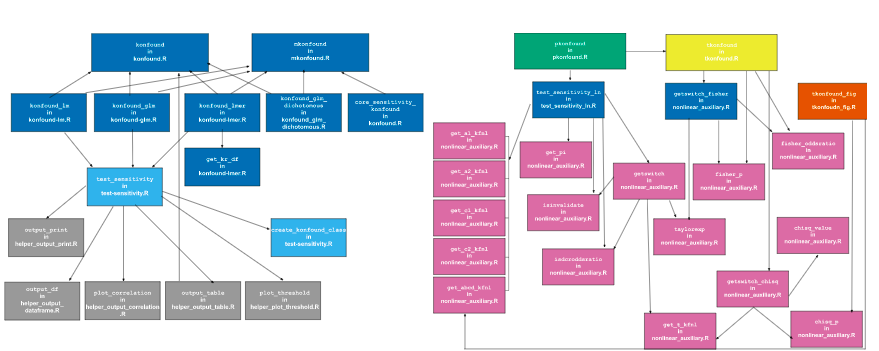

```{r setup, include=FALSE}
knitr::opts_chunk$set(echo = TRUE)
```

After logging off a two-hour meeting I immediately paused and thought *"wait, I'm a developer?"*

The meeting was part of the IES-funded Quantifying the Robustness of Causal Inferences [project](https://ies.ed.gov/funding/grantsearch/details.asp?ID=5723) where we discussed the redesign and architecture of the [konfound](https://cran.r-project.org/web/packages/konfound/index.html) R package. This (*kinda*) big task came to light when we decided to visually map out the R functions in the package to understand the structure and how we could add in new functions for newly developed statistical methods. And well, it ended up looking a little interesting (figure 1).

```{r pressure, echo=FALSE, fig.cap="Initial Package Architecture (oopsie)", out.width = '70%', fig.align="center", wrapfigure = list("R", .7)}


```

We all decided that we wanted to work smarter :bulb:, not harder so we decided to brainstorm ways into which we could better structure the functions within the \`konfound' package in a way we could easily incorporate functions for newly developed statistical methods. In other words, we wanted a stable back-end structure to add new functions until the end of time :grimacing:

> "We built this plane while flying it" - J. Rosenberg, 2022 :airplane:

### `Konfound` + THE Question

As of right now, the three main functions in the `konfound` package (`konfound`, `pkonfound`, `mkonfound`) mainly support linear models :chart_with_upwards_trend: (some non-linear) for two causal inference sensitivity analysis techniques (omitted variables and replacement of cases). But we have plans for incorporating more techniques that support linear and non-linear models. So the question was *"how do we restructure the architecture of the functions to support future development on the back-end and provide the best experience for the user on the front-end?"* **Womp womp womp**. Wait, I'm a *developer*? :scream:

### Development Considerations

Here are a *few (well, let's be real, 7)* things to consider when answering this question:

1.  The **purpose driving the development** of your main functions will likely dictate the overarching structure of your package. *For example*, the purpose of the development of the `konfound` package is to **provide users with an easy use function to conduct causal inference sensitivity analysis**. So it might make sense to set these techniques at the **top** of the hierarchy structure then build down from there.\
    <br>
2.  **How many arguments is too many arguments?** How many arguments should a user specify in order to run the analysis? How many arguments could a user specify to refine the analysis? Which arguments should be default?\
    <br>
3.  **How many functions are too many functions?** Should there be a function based on model type (linear or non), technique type, context type (established model, results from already-conducted analysis, meta-analysis) or a combination of these? Here, there can be as few as 3 main functions and as many as:exclamation:24 main functions:exclamation: :flushed: *(calculated by using the rule of product for our future development plans)*.\
    <br>
4.  **What should be written in error messages?** Should there be warning messages? If so, what should be included in these messages?\
    <br>
5.  Probably the most important consideration, what are the **user's needs**? How *will* they use the functions vs. how *we think* they will use them? How can we anticipate their needs to minimize user error and increase user experience? :sparkles:**(this is the #1 UX principle)**:sparkles:\
    <br>
6.  Is there a middle ground between **creating a strong back-end structure and a strong front-end structure**?\
    <br>
7.  Will changing the current structure of the functions within the package **confuse or drive away current users** of the package? If we decide to change the structure in a way that is different from the current structure, how can this be executed in a way that is least burdensome for current users? (the dreaded :warning:deprecated:warning: error message) :cold_sweat:\
    <br>

### Final Words: Truly Yours, TBD

As of writing this, I don't have any immediate answers to these questions. I think it depends on the **end goal** of your package and functions. I personally have a preference in how we should proceed in our case of the `konfound` project, but definitely need some time to throw spaghetti at the wall, so-to-speak.

But, I wanted to share these thoughts and reflections as someone who unknowingly entered the world of #Rstats development.

### Keep Tabs on the Project

Stay tuned for updates that will be posted on my blog. You can also follow the confound project at <https://www.konfound-it.org/>
