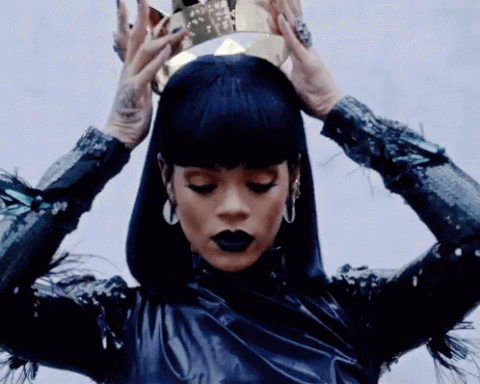
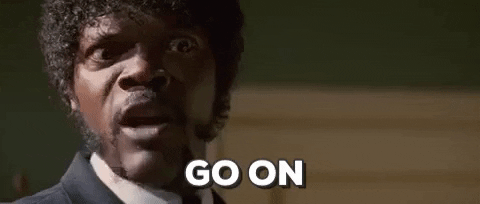
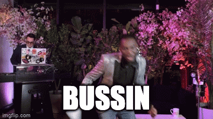

```{r setup, include=FALSE}
knitr::opts_chunk$set(echo = TRUE)
```

These are my reflections on my dissertation study. Surely more dissertation updates will be published throughout the course of this study. 

### What’s a Psychological Scale?

Some of you may be wondering what a psychological scale is, which is a totally fair question. Let me go ahead and put my ‘Teacher Sarah’ hat on. 

```{r, echo=FALSE}

```

Ok, it’s on now. 
\*clears throat*\

You know how we have scales to measure our body weight? **Body weight** is something tangible that we can **see and touch**, and we can measure body weight with a scale. Scales (aka instruments) are commonly used within the medical field to measure different biological attributes (aka biometrics :eight_spoked_asterisk:). Well, we can do the same thing within the psychology field. We can use instruments and scales to **measure things we can’t necessarily see or touch**, but we know that it exists (aka latent traits). Personality is the perfect example. We can’t look at someone’s brain and know if they are introverted or extroverted, but we can give them an instrument/scale with different questions which can let us know if someone is more introverted or extroverted. 

### Ok, Got It. So What?

Well my dear friend, my dissertation study is all about developing a psychological scale. So read on if you care about what I’ve been working on.

### I Decided To Read On, Sarah.

Cool, thanks for staying with me. I'm developing a scale that measures a psychological trait within middle and high school students. I won’t tell you what I’m measuring until my dissertation is published (or if you attend my defense in April 2023). I have a fear of someone within academia copping my idea (happens often tbh). 
```{r, echo=FALSE}

```


While there is a certain procedure and steps to take in developing these scales, it’s proving more difficult than I thought. Based on psychological theories and reading **over 300 articles** on this topic, I feel like I have developed a well-informed hypothesis and the first draft of the scale. I sent the questions on the scale to content experts for them to score the questions on how clear they are and how relevant they are to the psychological trait I'm trying to measure. Based on expert feedback, I made revisions to the scale questions. But I feel like I’m starting to get in my head and overthink things :tired_face:. I am documenting every revision I made and the justification. But I am getting concerned that it only makes sense to me, and that my scale development process is heavily biased. Biased in the sense that these decisions can be **‘mushy’** and I cannot, as a researcher, separate my lived experiences and reality from my research. I anticipated the bias underpinnings and am using a :sparkles:QuantCrit:sparkles: methodological approach to be transparent and reflective about how my worldview impacts the creation of these scale. But I don’t know, it feels so sticky. 

I also wrestle with knowing if two different questions on the scale mean the exact same thing. For example, does saying **“I am hopeful for my future”** mean the exact **same** thing as **“I maintain my hopes for the future”**? I don’t know! My initial thought is yes, but what if there is some *nuance* I’m not picking up on. And when did this study turn into a **linguistic study**?! :sob: Also, will middle and high school students know what the word “stereotype” is? What do they think about when they think about “combating stereotypes” in their community. No clue :sweat_smile:

### How Are You Going to Quell These Concerns?

Luckily, the next step in the scale development process is conducting :sparkles:cognitive interviews:sparkles: with middle and high school students to understand how their brain processes these words and questions. Cognitive interviewing is actually a really cool process, tbh :sunglasses:

### This Bussinnnnn: Cognitive Interviewing

This is probably my favorite way to explain what cognitive interviews are to those who are unfamiliar with it. These ‘interviews’ are basically a chat so I can understand how someone interprets questions they are being asked. For example, **if I ask “is this food bussin?” I want to understand what the word “bussin” means to you**. 

```{r, echo=FALSE}

```

I should be conducting cognitive interviews in the next few weeks so I might write another post about my experience conducting them. I won’t share any data of course :stuck_out_tongue_closed_eyes:

### TLDR

Scale development is a lot **harder** than I expected because I feel like the process is **squishy** and it’s  subjective. I think it goes back to my favorite quote: **“social science is messy.”** Messy as hell tbh. Now I know why there are researchers that dedicate decades to creating a scale. You never get it right on the first try. It’s a long, iterative process to develop a scale you feel confident that measures the psychological trait you’re attempting to measure. 

There are times I feel really confident with my study and other times I need to **close my laptop** and go for a walk :shoe:. I take comfort in knowing that I can justify every decision I have made thus far, and that no one ever gets it right the first time. Needless to say, I’m thinking about this study **veryyyyyy hard**. Maybe **overthinking** sometimes:smiley: But I think that’s what makes me good at what I do :sunglasses:

Wish me luck :four_leaf_clover: More updates to come :eyes: 


