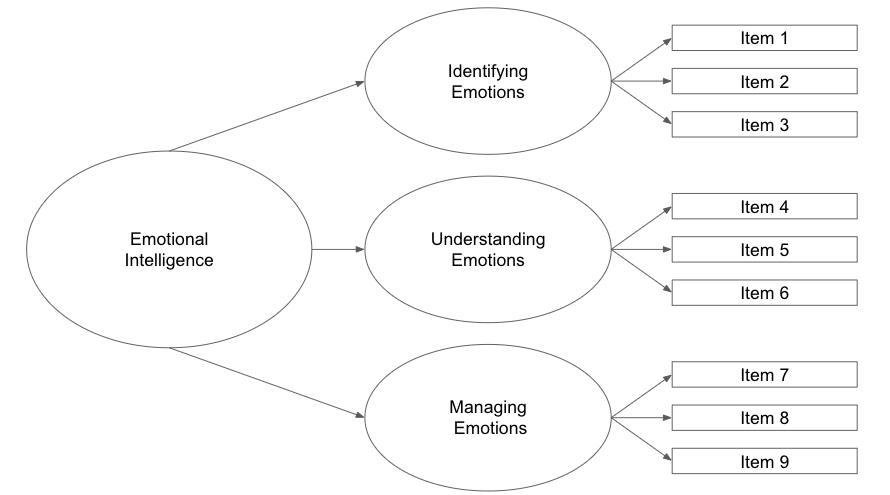

```{r setup, include=FALSE}
knitr::opts_chunk$set(echo = TRUE)
```

Hi! Thanks for reading the **final** update of my dissertation study :satisfied: If you’ve been reading since the first blog post of this series, I hope you enjoyed the ride :train: Thanks, OG :sunglasses:

### Recap

The first [post](https://www.sarahnarvaiz.com/blog/diss_update1_blog/) of this series talked about the difficulties of developing a psychological scale, the second [post](https://www.sarahnarvaiz.com/blog/diss_update2_blog/) discussed the importance of cognitive interviews, the third [post](https://www.sarahnarvaiz.com/blog/diss_update3_blog/) talked about pilot testing a scale, and **this** post will briefly discuss the :sparkles:**final**:sparkles: administration and analysis of the scale. 

### Scale Development

As noted in the first post, my dissertation study focused on developing a scale that measures a psychological trait within middle and high school students. There are certain procedures and steps that must be taken in efforts to ensure a rigorous study and takes years to refine a newly developed scale. However, the final analysis in a scale development study is typically an exploratory factor analysis (EFA) which is conducted to understand the dimensionality of the latent trait you’re attempting to measure. In other words, if we were to draw out a diagram of this latent/psychological trait’s structure, what would it look like? Maybe something like the figure below (just as an example). 

```{r pressure, echo=FALSE, fig.cap="Dimensionality of Example Emotional Intelligence", out.width = '100%', fig.align="center", wrapfigure = list("R", .7)}


```

This is a theoretical figure that I made up for illustration purposes. The idea is that we developed a scale that we believe measures emotional intelligence :heartpulse:. When we get to the final step in our scale development process, we conduct an EFA to better understand the dimensionality (or the structure) of emotional intelligence:heartpulse:. An EFA is an iterative :repeat:, model building process with various assumptions and decisions the researcher(s) must carefully consider. For the sake of this example, let’s say figure 1 is the final model the researcher(s) land on. Based off this model, we can see that emotional intelligence :heartpulse: has :three: sub dimensions (identifying emotions, understanding emotions, and managing emotions). For each of these sub dimensions, the rectangle boxes to the right are the items (or questions) on the scale that measure (or tap into) these sub dimensions. For the record, models will almost never look this clean and orderly in the nascent phase of scale development and their EFAs :new_moon_with_face:

### How did yours go, Sarah?

Thanks for asking! :smile: To be honest, it went **A LOT** better than anticipated. Mainly due to the fact that I ended up with a small(ish) sample size for conducting the EFA. There’s conflicting literature and recommendations about what’s a “good” sample size :eyes: (Beavers et al., 2013; Fabrigar et al., 1999; Lawley & Maxwell, 1971; MacCallum et al., 2001). Mine met several recommendations :thumbsup: but, overall, I had less than :three::zero::zero: observations. 

However, I did conduct three different sensitivity analyses to compare my final model against. And, well, my final model **almost exactly matched** the final models in the sensitivity analyses process :sunglasses:. One technique I used to compare my model against was the regularized exploratory factors analysis (Jung, 2013) which performs better in estimating latent constructs with small sample sizes. This method performs well using a regularized covariance matrix to produce more stable estimates with no risk of model convergence (Jung, 2011). I was able to use this technique in R with the [`fungible()` package](https://cran.r-project.org/web/packages/fungible/fungible.pdf) :smirk:

Overall, my final model largely reflected the hypothesized model I developed at the beginning of the study with a few good and helpful surprises/findings. The findings from this study prompt future exploration of the dimensionality and overall understanding of latent trait of interest (which I do intend on further exploring in the near future).

That concludes this series of blogs! Thank you for reading the final blog of the dissertation series :innocent: I do hope you enjoyed this fun ride as much as I did! Please stay tuned for my published paper where I can give you more details about the content topic of the study.

Talk to you soon! :two_hearts:

### Psssssttttttttt….
P.S. My next blog post will be a mini tutorial on information buttons in Shiny apps. Stay tuned if you’re interested :wink:


