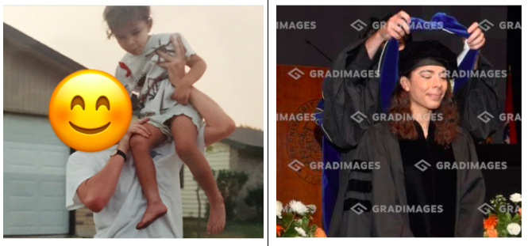
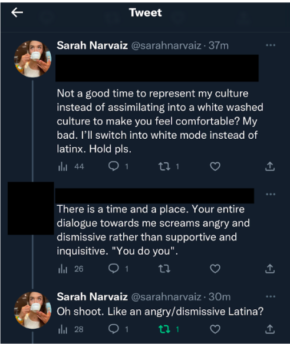

```{r global.options, include=FALSE}
knitr::opts_chunk$set(echo = TRUE, fig.align="center")
```

Hi, welcome to this blog. This one in particular is close to my heart, and it took a lot of courage to sit down and write it. I’ve been thinking about writing this for over a year now… but couldn’t bring myself to actually do it, because 1) I was afraid of potential backlash impacting finishing my PhD as well as job prospects and 2) it requires vulnerability on my part and I wasn’t at the point to be vulnerable with the academic/research community. Ultimately, the more I bottled this up, the more it needed to come out in some form. Now that I’ve graduated with my PhD, I feel more safe to write this. And in terms of job prospects, if any potential employer has an issue with what is in this post, I don’t want to work for them anyway. *Takes a breath* Okay, here we go…

### A Little Backstory

I feel the need to provide a little background before going any further solely for the purpose of not being accused of cultural insensitivity. I hate how I even have to provide this background because it’s extremely personal and something I don’t like talking about. But I also need to think 5 steps ahead and protect myself against those who are quick to judge and jump to conclusions. 

I was born and raised in San Antonio, TX and is where I currently live. Like the title of this post applies, I consider myself to have grown up in the hood. Let me be more specific, I lived in various areas of San Antonio when growing up and at a brief period of time was considered homeless. My primary caregiver was my biological mother who was barely at home. I won't go into the specifics of why she wasn’t at home because it doesn’t help the message of this blog, but I will say that my brother and I had to take care of ourselves. That means a lot of different things but mainly being forced to become an adult earlier than we should have. Since we didn’t have any parents at home, we basically grew up in the streets and took on that culture. It’s a hard culture to describe… it’s one of those things where you know it when you see it. When we weren’t going through our mom’s old purses to find enough change to buy burgers from the McDonald’s dollar menu, we went to the CD exchange across the street to sell old CDs and DVDs to make up for it. For me, I either stayed at home reading or would walk the 5 miles to the nearest park to watch my brother play pick up ball. During this time, not only did I develop the skills to take care of myself, I developed something you would call “street smarts” which comes along with this culture I’m having trouble describing. But again, you know it when you see it. Honestly, I never minded it during the time, probably because I didn’t know any different. It was normal for me. Fast forward to present day, I live on the South Side of San Antonio where I also lived for a brief moment of time when I was little. South SA is like home to me. Some would consider my current neighborhood as the “hood” but honestly, I don’t mind it, probably because I’m used to it. This is the most detail I’ll go into for the prelude, I don’t think anything additional is necessary for the remainder of this story. I am saddened that I have to explain my cultural background before proceeding to protect myself against being essentially canceled. In other words, I hope I don’t get canceled for calling my upbringing as hood because if you had to reduce it down to one word, that’s exactly what it was.

### Code Switching

Some of you may wonder what code switching is. Harvard Business Review defines code switching as “adjusting one’s style of speech, appearance, behavior, and expression in ways that will optimize the comfort of others in exchange for fair treatment, quality service, and employment opportunities.” And whewww, I feel SEEN. I inadvertently started practicing code switching during undergrad mainly after getting flamed by my peers for doing and saying certain things. I’ll never forget sitting outside a coffee shop and talking about the university library where I was flamed for pronouncing “ly-Berry'' instead of “ly-BRR-AirE.” That was such a pivotal moment because that was the last time I said “ly-Berry.” As I moved through my undergrad, masters, and working at a small education research company before pursuing my PhD, I continued to adjust how I spoke, acted, and presented myself. I chose to keep a lot of myself hidden always in efforts to blend in, sound smart, be professional in order to be taken seriously. 

```{r, echo=FALSE, fig.cap="From Hood to Hooded", out.width = '100%', fig.align="center", wrapfigure = list("R", .7)}


```

### Code Switching During My PhD

I kept this charade up for the majority of my PhD studies for the sole purpose of wanting to be taken seriously and not avoid any stereotypes people place with the street culture that lives forever in my body. It’s like what I tell my sister, “you can take the girl out the hood but you can't take the hood out the girl.” It’s literally part of my identity to which I seldom show. I wanted to be seen as intelligent and capable by my peers, advisors, mentors, and faculty. I was afraid that if I ever slipped up, it would cost me opportunities to further my career in research. Luckily for me, I was smart enough to catch onto the unspoken rules of academia in how one should write and present. I don’t think many PhD students are taught how to write academic papers but trust me when I say there is a very specific structure and format to follow in order to be accepted. While I was able to pick up on these “more accepted” ways of communication, there were endless times where I thought “WHY do I have to write or speak in this flowery type of way?! It would be soo much easier to say it this way (the natural way it comes to my brain).” This sentiment reminds me of dominant vs. non-dominant cultures in the community cultural wealth work (which I studied for my dissertation and continue to study): “Not only are individuals from non-dominant classes restricted and oppressed but are deliberately challenged by feeling the need to expend more emotional mental and physical energy” (Narvaiz, 2023, p. 8) if they are in communities of dominant culture. And dangggg, I feel SO SEEN. It takes so much more mental energy to change my natural communication style in order to fit the dominant communication style of academia. To be honest with you, the style of academic writing has been so ingrained in my brain that I think I tend to automatically write in that style now. Some of my friends say I have a big vocabulary and I always apologize and say “I don’t mean to, it’s just the way it comes to my brain.” 

### Nah Fam, Im Exhausted

Towards the final year of my PhD, I was becoming really tired of keeping the real me hidden. Simultaneously, I started to become more and more comfortable with my mentors and advisors at this time. I was certain that they knew I was talented, hardworking, and driven, and that they respected me. I really wanted the real me to come out. And it did, slowly… Let’s talk about it.

### Kids See Ghost

Kids See Ghosts is what slowly started this vulnerability. In particular, it was this [song](https://www.youtube.com/watch?v=rnZQvgWhM5s). Thanks Kid Cudi. You a real one. One of my dear mentors, collaborators, and someone I consider a friend, asked me to lead a data science lab where we taught data science to East Tennessee high school students. On the first day of lab, I presented the various uses of data science (e.g., in the education field, gaming field, sports field, and music field). As part of a demonstration to connect with the students, I downloaded my Spotify wrapped from the previous year to talk about the analytics that went behind it. It showed my top ten songs and artists listened to and the genres they belonged to. As part of the wrap, a snippet of the Kids See Ghosts “Feel the Love” song played. 

I ended up having a one-on-one lunch with my mentor that week. And to be honest with you, I don’t know how it came up. All I know is that a moment occurred where I had the choice to be honest and vulnerable with them about that street culture that I kept hidden. Like I said, I consider this mentor to be a friend and someone I trust through and through so I told them. I went something like “I don’t know how to say this, but I’m kinda hood on the inside.” I started to tell them about my experience code switching and keeping my hidden identities. He listened and thanked me for choosing to be honest and vulnerable. He also started to share his hidden identities with me and how that has impacted his life. This was a pivotal moment for me.

### We Ball

Since that moment, I started taking stock of my career life. I realized I was undeniably talented. Just because I talk or act a certain way doesn't make me dumb, doesn't make me a poor methodologist, doesn't make me a poor programmer, doesn't make my passion for wanting to serve underrepresented and underserved communities through my work any weaker, and doesn't make me any less passionate about the work I do. Point Blank. 

So during my final year of my PhD, I started to let out my hood more and more, always respectfully tho. Much like this blog post, as I write this post more and more, I feel comfortable writing the way I WANT to write. 

### The Backlash Tho

Nothing changed. My mentors, advisors, and faculty still respected me and my work, and for that I will be forever grateful. As a reminder, I was doing this in my little bubble where I developed rapport, trust, respect, and vulnerability. It goes without saying that my communication style was not appreciated across the vast pool of the dominant-centered culture of academia and the research world. The biggest backlash I faced was when I replied to a Tweet that felt kinda icky tbh. Someone tweeted that in favor of women in graduate programs being paid more so they can go on dates in order to start a family. I replied to the tweet saying “ngl this felt outta pocket” because there are plenty of graduate students (regardless of gender) that are struggling to survive (living in labs, not eating) because graduate students are being paid at poverty levels.

To be honest with you, I shouldn’t have engaged. But with all this DEI talk in academia, I was stupidly hopeful. From the jump, I talked the way I would normally talk to one of my friends saying things like “ngl, this felt outta pocket” and referring to someone as “mamas” or “mamita” (a term of endearment used in the Latino culture). The whole conversation escalated QUICKLY. 

```{r tweet, echo=FALSE, fig.cap="Twitter Backlash", out.width = '100%', fig.align="center"}


```

I also belong to the powerlifting (PL) community which is one of my biggest communities I rely on. To be sure I wasn’t tripping and to share my experiences in academia with those in the PL community, I shared pieces of this conversation. And to be honest with you, I received warm support and validation that I was, in fact, not tripping. I think the part that upset me the most was my language was described as “screams angry and dismissive” by saying “you do you.” Man, I tell my friends to do them all time and I will do me. It’s just a thing you say, you know? No hate. 

It took a minute to recover (and by a minute, I mean weeks lol). Mainly because it confirmed my previous fear of being seen as something less than I was regardless of my intellect, skills, and hardwork. More importantly, it saddened me because, in my eyes, it showed that DEI efforts at universities seem to be a hot topic buzz word people love to tout but it’s simply just that. In other words, academia and the research field talk the talk about DEI efforts and most certainly don’t walk the walk. As an individual who has dedicated their career to supporting underrepresented and underserved populations (also as a woman who belongs to these populations), this is a slap in the face. I can talk more about this DEI facade from my own experience, but perhaps I’ll have it for another blog post. All I want to say about it, is that in my experience, when people talk about DEI efforts, they frontin. Point blank.

### Finding My Voice, Knowing My Worth

Like I said earlier, “we ball.” I’m still experimenting when to tap into and display my hidden identities. I’ve still learned that it only comes natural when I feel comfortable and not threatened. For example, a few weeks back I was talking to one of my mentors about personal struggles of being on the job market. I was being vulnerable in the conversation and couldn’t think of the term “over compliments” so I said “gasses me up too much” because it was the first thing that came to my mind. You know what? They didn’t even bat an eye and continued to listen. They reaffirmed towards the end that I am capable and smart enough because I “wouldn’t have gotten this far” if I wasn’t it. I just want to be clear that this mentor is pretty famous in my field to the point he has served on the National Academy of Sciences. As I continue to develop a working relationship with this mentor, they have always respected me and clearly see my talent in the work I do. A big thanks to the mentors out there (all of mine included) that operate like this. I’ll be forever grateful to you all.

As for me, I’m still working on finding my voice and balancing these two identities: researcher and a little hood. I’ll just say I was confident enough to include a Snoop D.O.G.G. quote into the acknowledgements page into my dissertation and to call my two main mentors GOAT. Because they are the GOATS. All I know is that just because I speak and act a certain way, doesn’t diminish my skills, intellect, and passion. I’m still here to live out my career commitment. Honestly, I’m feeling like Michael Jordan before the 1984 draft. With that said, I know I’m Michael Jordan before the 1984 draft. IYKYK.

If you read this entire post, thank you for listening to my story. It’s something I’ve needed to say for a long time now.

See you in the next one :) 
