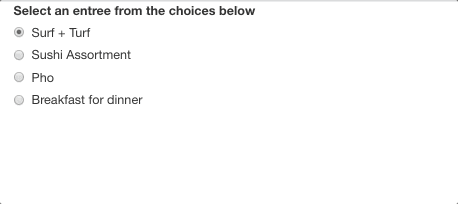
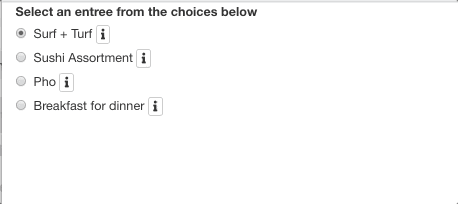
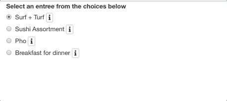

```{r setup, include=FALSE}
knitr::opts_chunk$set(echo = TRUE)
```

Hi! Welcome to this brief tutorial on how to incorporate information buttons into your shiny applications :)

This tutorial was inspired by my current job where I am leading the redevelopment of a Shiny application to conduct sensitivity analyses for causal inference methods. We are almost done with the development of the new and improved app (just need to conduct testing) so I can't share the beta version with you quite yet, but here is what the OG [app](https://jmichaelrosenberg.shinyapps.io/konfound-it/) looks like if you're curious :)

Ok, let's jump into it!

## Basic Example
I've created a simple example that shows different entree choices for a user to select.

```{r, eval = FALSE, message=FALSE}
library(shiny)

# Define UI for application
ui <- fluidPage(
          radioButtons("entree", "Select an entree from the choices below",
                       choiceNames = list("Surf + Turf", "Sushi Assortment", "Pho", "Breakfast for dinner"),
                       choiceValues = list("surf", "sushi", "pho", "break"))
)


server <- function(input, output) {

}

# Run the application 
shinyApp(ui = ui, server = server)

```


Which looks like this...
```{r, echo=FALSE}

```

So it's pretty **basic** tbh. What if the user wanted to know a little bit more about the entree choices before committing? Well we can use information buttons to help!

## Same Example but Less Basic
We will be using the `shinyBS` package. Note: The R documentation can be found [here](https://cran.r-project.org/web/packages/shinyBS/shinyBS.pdf) and [here's](https://ebailey78.github.io/shinyBS/) the package's designed website with additional information.

```{r, eval = FALSE, message=FALSE}

library(shiny)
library(shinyBS)

# Define UI for application
ui <- fluidPage(
          radioButtons("entree", "Select an entree from the choices below",
                       choiceNames = list(
                         list("Surf + Turf",
                              bsButton("surf-info", label = "", icon = icon("info", lib = "font-awesome"), style = "default", size = "extra-small")), 
                         list("Sushi Assortment",
                              bsButton("sushi-info", label = "", icon = icon("info", lib = "font-awesome"), style = "default", size = "extra-small")), 
                         list("Pho",
                              bsButton("pho-info", label = "", icon = icon("info", lib = "font-awesome"), style = "default", size = "extra-small")), 
                         list("Breakfast for dinner",
                              bsButton("break-info", label = "", icon = icon("info", lib = "font-awesome"), style = "default", size = "extra-small"))),
                       choiceValues = list("surf", "sushi", "pho", "break")),

)


server <- function(input, output) {

}

# Run the application 
shinyApp(ui = ui, server = server)
```

### Code Walk Through Part 1

So are using the `bsButton()`function to produce the UI (or the visual icon) for the information button. Since we want each radio button (i.e., each entree option) to have it's own designated information icon, we need to make a list within a list. The parent list element (the primary list container) is the list containing the entree choice names. In this case, `choiceNames` is the parent list and within that list are four child list elements (one list per entree choice). We structure our code this way in order to attach an information icon button for each of the radio buttons (i.e., each entree option). If we don't create these child list elements, the `radioButton()` function will try to read the `bsButton()` as it's own function argument and you will receive an error.

Let's review the code within the child list ement for the first choice: Surf + Turf. The `bsButton` requires a few arugments. The first being, an inputID (this is important and we'll come back to this in a few paragraphs). In this case, we gave the first choice an inputID as `surf-info`. The next argument is a label. The R documentation says this for the label argument: "The contents of the button or link–usually a text label, but you could also use any other HTML, like an image." We will leave this blank (i.e., " ") since we want to generate an icon and not an actual word for the button graphic. The next argument is `icon` which is optional and only needed if you want to display an icon for this button (which we do!). In this case, I want to use the `font-awesome` library's information icon. You will need to install fontawesome before this step :) The fontawesome documentation is [here](https://github.com/rstudio/fontawesome) and [here](https://fontawesome.com/icons?d=gallery&m=free) is a list of all fontawesome icons :) Next, we want to use the default stype of the icon button, and lastly, we want the icon to be extra small.

Here's what is looks like thus far...

```{r, echo=FALSE}

```

This is looking better! We have the icons working, but we need to add information to the icons as popovers using BSpopover :)

```{r, eval = FALSE, message=FALSE}

library(shiny)
library(shinyBS)

# Define UI for application
ui <- fluidPage(
          radioButtons("entree", "Select an entree from the choices below",
                       choiceNames = list(
                         list("Surf + Turf",
                              bsButton("surf-info", label = "", icon = icon("info", lib = "font-awesome"), style = "default", size = "extra-small")), 
                         list("Sushi Assortment",
                              bsButton("sushi-info", label = "", icon = icon("info", lib = "font-awesome"), style = "default", size = "extra-small")), 
                         list("Pho",
                              bsButton("pho-info", label = "", icon = icon("info", lib = "font-awesome"), style = "default", size = "extra-small")), 
                         list("Breakfast for dinner",
                              bsButton("break-info", label = "", icon = icon("info", lib = "font-awesome"), style = "default", size = "extra-small"))),
                       choiceValues = list("surf", "sushi", "pho", "break")),
          
          bsPopover(
            id = "surf-info",
            title = "More information",
            content = HTML(paste0(
              "Ribeye steak, grilled jumbo shrimp, butter roasted potato medley, grilled asparagus."
            )),
            placement = "right",
            trigger = "hover",
            options = list(container = "body")
          ),
          bsPopover(
            id = "pho-info",
            title = "More information",
            content = HTML(paste0(
              "Rice noodles, braised oxtail, and anise-coriander scented broth."
            )),
            placement = "right",
            trigger = "hover",
            options = list(container = "body")
          ),
          bsPopover(
            id = "sushi-info",
            title = "More information",
            content = HTML(paste0(
              "20 piece assortment of nigiri and sashimi with tuna, salmon, eel, and yellowtail."
            )),
            placement = "right",
            trigger = "hover",
            options = list(container = "body")
          ),
          bsPopover(
            id = "break-info",
            title = "More information",
            content = HTML(paste0(
              "Sarahs Saturday special of chocolate Kodiak pancakes, soft scrambled eggs, and an assortment of seasonal fruit."
            )),
            placement = "right",
            trigger = "hover",
            options = list(container = "body")
          )
          
)


server <- function(input, output) {

}

# Run the application 
shinyApp(ui = ui, server = server)
```

### Code Walk Through Part 2

In the first walk through, we discussed how we generated the information buttons, but now we need content/text in the button! That's where `bsPopover()` enters the chat. You probably recall us discussing the inputID needed for each button using the `bsButton()` function. We will need the use the same ID in the `bsPopover()` function so R can map the content/text to the graphic icon. Next, we need a title to be displayed for each button. In this case I used "More information" but you can always change this or provide an empty string. Next! We need to provice the content/text for each button. You can see I provided a description for each entree in the code above. Side note: it was in this moment I realized I could never have a career as a menu writer LOL. Placement is the next argument for the `bsPopover()` function, and this tells R where to display the icon that is attached to it's designated list/word element (e.g., should the icon be placed on the righthand side of the entree radio button or to the left?). Next, it asks how we want the content/text to be triggered to which we said it's triggered when the user hovers over the icon. The last arugment is completely optional, but we want the content/text to be displayed using a body text style (aka body text).

Here's the final product! 


```{r, echo=FALSE}

```

## All done!

That's it! Thanks for reading and I hope you found something of value in this post. I'll probably plan on making more coding tutorials as they come up in my own work. In terms of blog posts, I do plan on creating a series of my thoughts on proposed Diversity, Equity, and Inclusion practices and equitable data practices that I see/read about in my field (as well as my own honest experiences).
