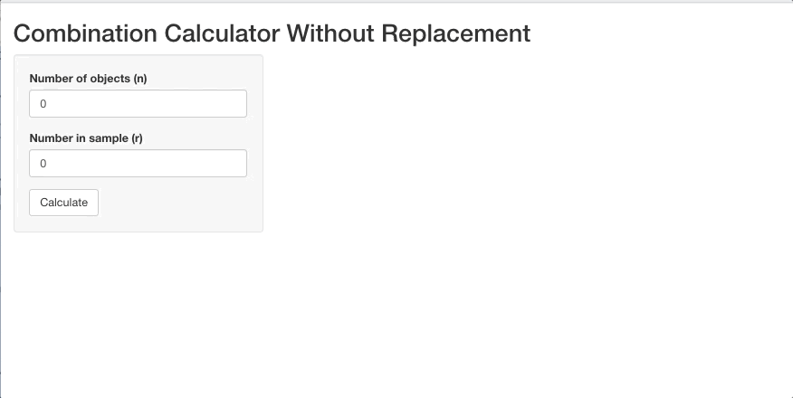
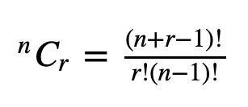
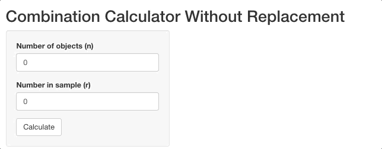
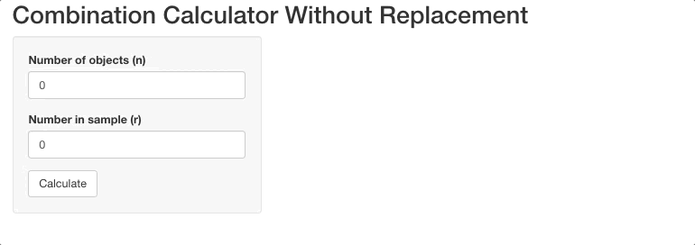

```{r setup, include=FALSE}
knitr::opts_chunk$set(echo = TRUE)
```

Read time: 5 minutes

Hi! Welcome to part 1 of this brief tutorial on shiny input validation and shiny app testing :) 

This tutorial was inspired by my previous job where I am led the redevelopment of a Shiny application to conduct sensitivity analyses for causal inference methods. The team is almost finished with development efforts and you can access the beta version [here](https://konfound-project.shinyapps.io/konfoundit/) if you're curious :)


Ok, let's jump into it!

## Basic Example
To get started, I've created a simple example to help with the understanding of when you might want to use input validation and shiny test. To illustrate these uses, I've created a basic combinations calculator (with replacement). For example, let's say we want to calculate the number of possible combinations to unlock my phone given a 6 digit password with 10 possible digits (digits 0 - 9) to which the any of these possible digits can show up more than one time (i.e. combination with replacement) in my 6 digit password (e.g., the number 2 can show up more than one time in my 6-digit password). I've provided the code below of the simple combinations calculator app:

```{r, eval = FALSE, message=FALSE}
library(shiny)

# Define UI for application
ui <- fluidPage(

    # Application title
    titlePanel("Combination Calculator Without Replacement"),

    # Sidebar with a slider input for number of bins 
    sidebarLayout(
        sidebarPanel(
            numericInput("objects",
                        "Number of objects (n)",
                        min = 1,
                        max = 50,
                        step = 1,
                        value = 0),
            numericInput("sample",
                         "Number in sample (r)",
                         min = 1,
                         max = 50,
                         step = 1,
                         value = 0),
            actionButton("go", "Calculate")
        ),

        # Show a plot of the generated distribution
        mainPanel(
          textOutput("combinations")
        )
    )
)

# Define server logic to calculate combinations
server <- function(input, output) {
  calc <- eventReactive(input$go, {
    round( #round calculation
      exp(lfactorial(input$sample + input$objects - 1)) / #(n + r -1)!
            (exp(lfactorial(input$sample)) * exp(lfactorial(input$objects - 1))), #r!(n-1)!
      2)
    
  })
  output$combinations <- renderText({
    paste0("There are ", calc(), " possible combinations with replacements")
  })
}

# Run the application 
shinyApp(ui = ui, server = server)

```


Which looks like this...
```{r, echo=FALSE}

```

So there are 5,005 possible password combinations that can unlock my phone. By the way, this is the formula for combinations with replacements (which is included in the server side of the app:

```{r, echo=FALSE}

```

Where n >= 0, and r >= 0. If n = r = 0, then CR(n,r) = 1

Ok this is great, but as of now the app doesn't follow the rules above:
```{r, echo=FALSE}

```

## Adding Validation Message
Let's provide the user with informative warning messages using the `validate()` function and use `if` `else` statements to satisfy the n = r = 0, then CR(n,r) = 1 rule.

```{r}
library(shiny)

# Define UI for application
ui <- fluidPage(

    # Application title
    titlePanel("Combination Calculator Without Replacement"),

    # Sidebar with a slider input for number of bins 
    sidebarLayout(
        sidebarPanel(
            numericInput("objects",
                        "Number of objects (n)",
                        min = 1,
                        max = 50,
                        step = 1,
                        value = 0),
            numericInput("sample",
                         "Number in sample (r)",
                         min = 1,
                         max = 50,
                         step = 1,
                         value = 0),
            actionButton("go", "Calculate")
        ),

        # Show a plot of the generated distribution
        mainPanel(
          textOutput("combinations")
        )
    )
)

# Define server logic to calculate combinations
server <- function(input, output) {
  calc <- eventReactive(input$go, {
    
    #User input validation
    validate(
      need(input$objects >= 0, "Did not run! Number of objects needs to be equal to or greater than zero"),
      need(input$sample >= 0, "Did not run! Number in sample needs to be equal to or greater than zero")
      )
    
    if( #if statement when objects are greater than 0
      input$objects >0) {
      round( #round calculation
        exp(lfactorial(input$sample + input$objects - 1)) / #(n + r -1)!
          (exp(lfactorial(input$sample)) * exp(lfactorial(input$objects - 1))), #r!(n-1)!
        2)
    }
    else{
      1
    }
    
  })
  output$combinations <- renderText({
    paste0("There are ", calc(), " possible combinations with replacements")
  })
}

# Run the application 
shinyApp(ui = ui, server = server)
```

Which looks like this...
```{r, echo=FALSE}

```

Nice! You can see that the validation message is triggered when the user inputs values for the objects or samples that are <0 and that our if/else statement worked when the object and sample inputs were both set to 0.

## All done!

That's it for now! A part 2 will be published next month where we will walk through how to test this app (specifically the validation messages) using the `shinytest2` package. Stay tuned!
